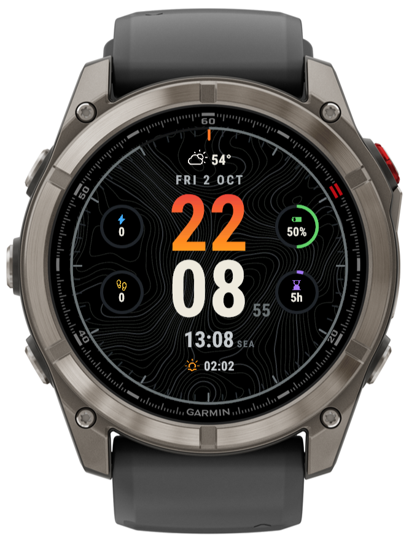
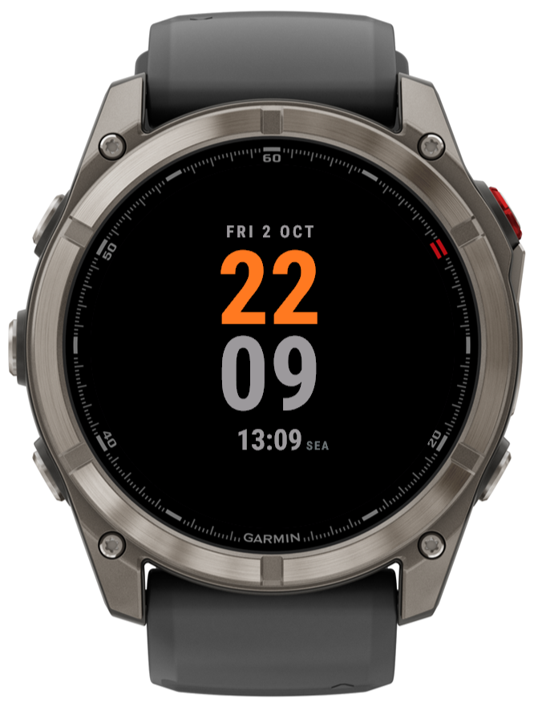

# Zweizonen

A dual time zone watch face for Garmin watches, built with the Connect IQ SDK.
*Zweizonen* is German for "two zones".

| Normal | Always-on |
|:---:|:---:|
|  |  |

## Features

- **Large stacked time**: the hour above the minutes, with the hour in a vertical
  gradient (red–orange or green–blue) or a solid color of your choice.
- **Second time zone**: pick from about 30 cities or UTC. Times follow each city's
  daylight saving rules automatically.
- **Four ring gauges**: each shows a metric of your choice with its icon and current value:
  - Body Battery
  - watch battery
  - steps
  - recovery time
  - weekly intensity minutes
  - floors climbed
- **Weather**: current conditions and temperature, plus the next sunrise or sunset.
- **Seconds ring** and minute/hour ticks around the edge.
- **Topographic background**: can be turned off for a plain black face.
- **Always-on mode** for AMOLED watches: the date and both times, without the gauges or
  background. It shifts slightly each minute to avoid burn-in.
- Follows the watch's 12/24-hour and °C/°F settings.

## Settings

You can change settings in two places:
- **On the watch**: open the watch face menu, select Zweizonen, and choose its settings.
- **On the phone**: in the Connect IQ app, for installs from the Connect IQ Store.

| Setting | Options |
|---|---|
| Second time zone | UTC or one of ~30 cities |
| Hour color | red–orange gradient (default), green–blue gradient, or a solid color |
| Top-left / top-right / bottom-left / bottom-right gauge | Body Battery, watch battery, steps, recovery time, intensity minutes, floors, or none |
| Topographic background | on / off |

## Supported devices

Round AMOLED watches with Connect IQ API level 5.0 or newer that include the Roboto
Condensed Bold system font. The face has been tested on a real in fēnix 8 Pro 47mm and
in the simulator on:

- fēnix 8 43mm, fēnix 8 Pro 47mm / 51mm
- fēnix 9 47mm / 51mm, fēnix 9 Pro 47mm, fēnix 9 Pro 51mm
- Forerunner 265, 265s, 970
- MARQ (Gen 2) Aviator
- Venu 4 41mm, 45mm
- vívoactive 6

**Not supported yet:**
- **Venu 2, Venu 3 and vívoactive 5**: they lack the Roboto Condensed Bold font.
- **MIP displays** such as the fēnix 7, Forerunner 255/955 and fēnix 8 Solar: they spend
  most of their time in low-power mode and would need their own layout.

Contributions that add devices are welcome. See [Building](#building) and the notes below.

## Building

Requirements:
- **Connect IQ SDK 9.x** and the device files, installed with the
  [SDK Manager](https://developer.garmin.com/connect-iq/sdk/).
- **Java 17** or newer.
- **A Connect IQ developer key**: `build.sh` looks for `~/.garmin/developer_key.der`, or
  set `GARMIN_DEVELOPER_KEY` to its path. You can generate one with OpenSSL:

  ```sh
  openssl genrsa -out developer_key.pem 4096
  openssl pkcs8 -topk8 -inform PEM -outform DER -in developer_key.pem -out developer_key.der -nocrypt
  ```

Build and run in Git Bash on Windows (`build.sh` uses the Windows SDK location and tools;
other platforms can run the same `monkeyc` commands directly):

```sh
./build.sh                       # build bin/fenix8pro47mm.prg
./build.sh fr265                 # build for another device
./build.sh fenix8pro47mm --run   # build, start the simulator and load the face
./build.sh --package             # build the Connect IQ Store package bin/zweizonen.iq
```

To sideload onto a watch, connect it over USB and copy `bin/<device>.prg` to the
watch's `GARMIN/Apps` folder.

### Notes for contributors

- **Layout**: designed at 454×454 px and scaled to the screen size. Positions and font
  sizes are in "design pixels" at the top of `source/WatchFaceView.mc`.
- **Gradient hour digits**: Connect IQ can't fill text with a gradient, so the hour is
  drawn in thin clipped bands, each in its own color, into a cached offscreen bitmap.
- **Rendering**: while the watch is awake, everything except the seconds is drawn once a
  minute into a full-screen offscreen layer. Each second then copies that layer and
  draws the seconds on top.
- **Background**: `helpers/topo.py` generates the topographic background image.
- **Design**: the original mockup is in `images/`.

## License

Zweizonen is free software, released under the
[GNU General Public License v3.0](LICENSE).

Third-party assets keep their own licenses (see
[THIRD-PARTY-NOTICES.txt](THIRD-PARTY-NOTICES.txt)):
- [Weather Icons](https://erikflowers.github.io/weather-icons/) by Erik Flowers, under the SIL Open Font License 1.1.
- [Material Symbols](https://github.com/google/material-design-icons) by Google, under the Apache License 2.0.

Copyright (C) 2026 Mitch Lindgren.
Code written by Claude.